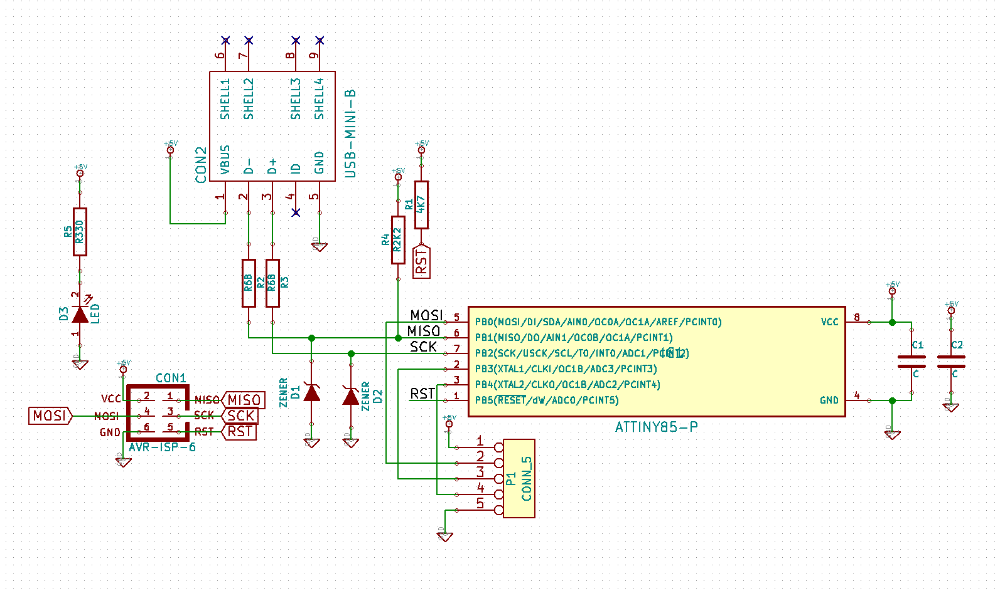

## dave's usb development ensemble (aka dude)

### Work in progress

This is a generalized development board for V-USB, using the ATTiny85 without a
crystal.

The board files are free for re-use, modification, and manufacture without
restriction.

The repository here contains KiCAD sources (schematic/board files),
basic V-USB code that implements a key-based HID media controller
(with modifications for this board) and a Bill of Materials listing.

***Note***: The VID/PID need to be properly defined before using this board in
production. This should be your own VID/PID, or from a source such as
[http://pid.codes](http://pid.codes).

## Usable pins

| Pin on ATTiny | Goes to | Connected to ISP as
|-|-|-|
|PB0|Pin 2 on connector | MOSI
|PB3|Pin 3 on connector | Not Connected
|PB4|Pin 4 on connector | Not Connected

## Bill of Materials

#### This builds one board

| Quantity | Description | Digikey Part Number | Notes
|-|-|-|-|
|1|2.2K ohm resistor|1276-5070-1-ND|Pull-up resistor for D-
|1|4.7k ohm resistor|P4.7KGCT-ND|Pull-up resistor for AVR RESET line
|2|68 ohm resistor|311-68GRCT-ND|USB data terminators
|1|10uF 16V 20% X6S 0805 (imperial) capacitor|490-10499-1-ND|Bypass at USB input
|1|6 pin AVR ISP header|3M9459-ND|For flashing the ATTiny85
|1|ATTiny85 (PDIP)|ATTINY85-20PU-ND|ATTiny in PDIP format

#### Optional components

| Quantity | Description | Digikey Part Number | Notes
|-|-|-|-|
|1|6 pin 8 pin DIP socket|A120347-ND|The older socket used in prototypes was P/N 390261-2 and was discontinued (***not yet sourced***)
|1|330 ohm resistor|1276-5050-1-ND|Current limiting resistor for PWR LED (***not yet sourced***)
|1|Power LED|475-2512-1-ND|0603 imperial
|1|Right angle 1x5 header|S5480-ND|For connecting to carrier boards

Note: "***not yet sourced***" indicates that these
components have not been sourced from the vendor, but should be equivalent to the parts that were used during prototyping. Buy or substitute at your own risk (they'll eventually be tested when enough parts are backlogged for a bulk order).

## Flashing firmware

Ensure that you have all the avr tools necessary to compile the firmware. On
Debian/Ubuntu based systems the dependencies are:

    sudo apt-get install -y build-essential gcc-avr gdb-avr binutils-avr avr-libc avrdude

In the firmware directory (depending on how your system permissions are setup pre-pending `sudo` may be necessary):

    cd firmware
    make hex
    make program
    make fuse

## Fuses (important)

These must be programmed, otherwise your board will not
enumerate with the host.

    avrdude -c buspirate -p attiny85 -P /dev/ttyUSB0
     -U hfuse:w:0xdd:m -U lfuse:w:0xe1:m

## Schematic

#### License

Board files, schematic and PCB are **CC0 1.0 Universal**.

V-USB firmware and accompanying source code is **GPL 2.0 licensed**.

For more information and full license text, see the LICENSE.md file in this
repository.
